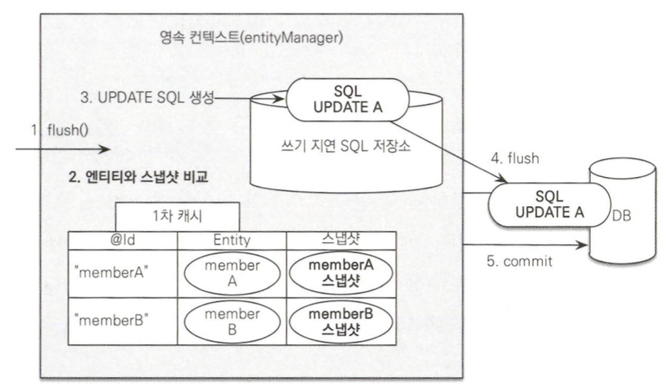

# 3.1 엔티티 매니저 팩토리와 엔티티 매니저

- 엔티티 매니저: 엔티티를 저장, 수정, 삭제, 조회 등 엔티티와 관련된 모든 일을 처리
    - 엔티티를 저장하는 가상의 DB로 생각하면 됨
    - 여러 스레드가 동시에 접근하면 동시성 문제가 발생하므로 스레드 간에 공유는 절대 금지
- 엔티티 매니저 팩토리: 엔티티 매니저를 만드는 공간
    - 비용이 상당히 큼 → 애플리케이션에서 한 개만 만들어 전체에서 공유함
    - 엔티티 매니저를 생성하는 비용은 거의 0
    - 여러 스레드가 동시에 접근해도 안전

# 3.2 영속성 컨텍스트란?

- 영속성 컨텍스트: 엔티티를 영구 저장하는 환경
    - JPA를 이해하는 데 가장 중요한 용어
    - 엔티티 매니저로 엔티티를 저장하거나 조회하면, 엔티티 매니저는 영속성 컨텍스트에 엔티티를 보관하고 관리
    - 엔티티 매니저를 생성할 때 하나 만들어짐
    - 엔티티 매니저를 통해 접근 및 관리 가능
- `persist()`: 엔터티 매니저를 사용해서 회원 엔티티를 영속성 컨텍스트에 저장

# 3.3 엔티티의 생명주기

- 엔티티의 4가지 상태
    - 비영속: 영속성 컨텍스트와 전혀 관계가 없는 상태
    - 영속: 영속성 컨텍스트 저장된 상태
        - 영속성 컨텍스트가 관리하는 엔티티
    - 준영속: 영속성 컨텍스트에 저장되었다가 분리된 상태
        - `em.detach()`를 호출해서 준영속 상태로 만들 수 있음
    - 삭제: 삭제된 상태

# 3.4 영속성 컨텍스트의 특징

- 영속성 컨텍스트와 식별자 값
    - 영속성 컨텍스트는 엔티티를 식별자 값으로 구분한다.
    - 영속 상태는 식별자 값이 반드시 있어야 함
- 영속성 컨텍스트와 데이터베이스 저장
    - 플러시(flush): 영속성 컨택스트에 새로 저장된 엔티티를 DB에 반영
        - JPA는 보통 트랜잭션을 커밋하는 순간 플러시를 함
- 영속성 컨텍스트가 엔티티를 관리하면 생기는 장점
    - 1차 캐시
    - 동일성 보장
    - 트랜잭션을 지원하는 쓰기 지연
    - 변경 가지
    - 지연 로딩

## 3.4.1 엔티티 조회

- 1차 캐시: 영속성 컨택스트 내부에 가지고 있는 캐시
    - 영속 상태의 엔티티가 저장됨
    - 캐시의 키는 식별자 값, 식별자 값은 DB 기본 키와 매핑되어 있음
- 영속성 컨텍스트에 데이터를 저장하고 조회하는 모든 기준 → DB 기본 키 값
- `em.find()`를 호출하면 먼저 1차 캐시에서 엔티티를 찾고 만약 없으면 DB애서 조회
- 영속성 컨텍스트는 성능상 이점과 엔티티의 동일성을 보장함

## 3.4.2 엔티티 등록

- 르랜잭션을 지원하는 쓰기 지연: 엔티티를 내부 쿼리 저장소에 INSERT SQL을 차곡차곡 모아뒀다가 트랜잭션을 커밋할 때 머다운 쿼리를 DB에 보내는 것

## 3.4.3 엔티티 수정

- SQL을 사용하면 수정 쿼리를 직접 작성해야 함 → 직/간접적으로 비즈니스 로직이 SQL에 의존하게 됨
- 변경감지: 엔티티의 변경사항을 DB에 자동으로 반영하는 기능
    - 영속성 컨택스트가 관리하는 영속 상태의 엔티티에만 적용됨
    - JPA의 기본 전략은 엔티티의 모든 필드를 업데이트 함
        - 수정 쿼리가 항상 같기 때문에 미리 생성해두고 재사용이 가능

- 스냅샷: JPA가 엔티티를 영속성 컨텍스트에 보관할 때, 최초 상태를 복사해서 저장하는 것
    - 플러시 시점에 스냅샷과 엔티티를 비교해 변경된 엔티티를 찾음

## 3.4.4 엔티티 삭제

- 엔티티를 삭제할 때, 엔티티 등록과 비슷하게 삭제 쿼리를 쓰기 지연 SQL 저장소에 저장했다가 플러시를 호출하면 실제 DB에 삭제 쿼리를 전달함

# 3.5 플러시

- 플러시(`flush()`): 영속성 컨텍스트의 변경 내용을 DB에 반영
- 영속성 컨텍스트를 플러시 하는 방법
    - `em.flush()`를 직접 호출
        - 테스트나 다름 프레임워크와 JPA를 함께 사용할 때를 제외하고 거의 사용하지 않음
    - 트랜잭션 커밋 시 플러시가 자동 호출
        - DB에 변경 내용을 SQL로 전달하지 않고 트랜잭션만 커밋하면 어떤 데이터도 DB에 반영되지 않음
        - 트랜잭션을 커밋하기 전에 꼭 플러시를 호출해서 영속성 컨텍스트의 변경 내용을 DB에 반영해야함
        - JPA에서는 트랜잭션을 커밋할 때 플러시를 자동으로 호출
    - JPQL 쿼리 실행 시 플러시가 자동 호출
        - 객체지향 쿼리를 호출할 때도 플러시가 실행됨
    
    ## 3.5.1 플러시 모드 옵션
    
    - `javax.persistence.FlushModeType`: 엔티티 매니저에 플러시 모드를 직접 지정하기 위해 사용하는 라이브러리
        - `FlushModeType.AUTO` : 커밋이나 쿼리를 실행할 때 플러시(default)
        - `FlushModeType.COMMIT` : 커밋할 때만 플러시
    - 플러시라는 이름으로 인해 영속성 컨텍스트에 보관된 엔티티를 지운다고 생각하면 안됨
        - 플러시: 영속성 컨텍스트의 변경 내용을 DB에 동기화하는 것

# 3.6 준영속

- 준영속 상태: 영속성 컨텍스트가 관리하는 영속 상테의 엔티티가 영속성 컨텍스트에서 분리된 상태
    - 영속 상태였다가 더는 영속성 컨텍스트가 관리하지 않는 상태
    - 준영속 상태의 엔티티는 영속성 컨텍스트가 제공하는 기능을 사용할 수 없음
- 영속 상태의 엔티티를 준영속 상태로 만드는 방법
    - `em.detach(entity)`: 특정 엔티티만 준영속 상태로 전환
    - `em.clear()`: 영속성 컨텍스트를 완전히 초기화
    - `em.close()`: 영속성 컨텍스트를 종료

## 3.6.1 엔티티를 준영속 상태로 전환: `detach()`

- `em.detach()` : 특정 엔티티를 준영속 상태로 만듦

## 3.6.2 영속성 컨텍스트 초기화: `clear()`

- `clear()` : 영속성 컨텍스트를 초기화해서 해당 영속성 컨텍스트의 모든 엔티티를 준영속 상태로 만듦

## 3.6.3 영속성 컨텍스트 종료: `close()`

- 영속성 컨텍스트를 종료하면 해당 영속성 컨텍스트가 관리하면 영속 상태의 엔티티가 모두 준영속 상태가 됨

## 3.6.4 준영속 상태의 특징

- 거의 비영속 상태에 가까움
    - 영속성 컨텍스트가 관리하지 않으므로 1차 캐시, 쓰기 지연, 변경 감지, 지연 로딩등 영속성 컨텍스트가 제공하는 어떠한 기능도 동작 안 함
- 식별자 값을 가지고 있음
    - 비영속 상태: 식별자 값이 없을 수도 있음
    - 준영속 상태: 이미 한 번 영속 상태였으므르 반드시 식별자 값을 가짐
- 지연 로딩을 할 수 없음

## 3.6.5 병합: `merge()`

- `merge()`: 준영속  상태의 엔티티를 받아서 그 정보로 새로운 영속 상태의 엔티티를 반환