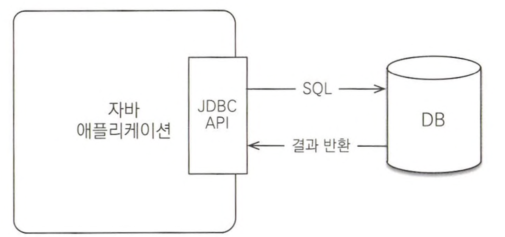
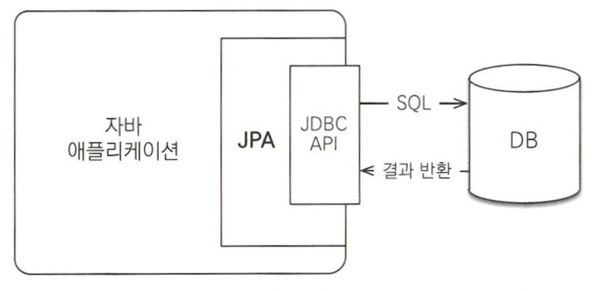

# 1.1 SQL을 직접 다룰 때 발생하는 문제점

- 관계형 DB → 가장 대중적으로 신뢰할 만한 안전한 데이터 저장소
- 자바로 개발하는 애플리케이션은 대부분 관계형 DB를 데이터 저장소로 사용함
    - JDBC API를 사용해 SQ문을 DB에 전달
    
    
    

## 1.1.1 반복, 반복 그리고 반복

- DB는 객체 구조와는 다른 데이터 중심의 구조를 가지므로 객체를 DB에 직접 저장하거나 조회할 수는 없음
    - 개발자가 객체지향 애플리케이션과 DB중간에서 SQL과 JDBC API를 사용해서 변환 작업을 직접 해주어야함
- 객체를 DB에 CRUD(Create, Read, Update, Delete)하려면 너무 많은 SQL과 JDBC API를 코드로 작성해야하고, 테이블마다 비숫한 일을 반복해야함
- DAO(Data Access Object)을 개발하는 일은 위의 과정을 해야하기 때문에 지루함과 반복의 연속임

## 1.1.2 SQL에 의존적인 개발

- 객체에 필드가 추가 되는 경우 DB에 저장된 경우 많은 SQL 코드를 수정해야하지만, 자바 컬랙션에 저장된 경우 코드 수정이 적음
- 애플리케이션에서 SQL을 직접 다룰 때 발생하는 문제점
    1. 진정한 의미의 계층 분할이 어려움
        - 엔티티와 아주 강한 의존관계를 가지고 있음
    2. 엔티티를 신뢰할 수 없음
        - 엔티티: 비즈니스 요구사항을 모델링한 객체
    3. SQL에 의존적인 개발을 피하기 어려움
        - 어느 객체와 연관된 객체를 사용할 수 있을지 없을지는 전적으로 사용하는 SQL에 달려 있기 때문에, DAO로 SQL을 숨겨도 DAO에 있는 SQL을 확인해서 SQL문을 확인해야함
        - 객체를 조회 및 새로운 필드를 추가할 때 DAO의 CRUD 코드와 SQL 대부분을 변경해야 함

## 1.1.3 JPA와 문제 해결

- 객체를 DB에 저장하고 관리할 때, 개발자가 직접 SQL을 작성하는 것이 아니라 JPA가 제공하는 API를 사용하면 됨
    - JPA가 개발자 대신에 적절한 SQL문을 생성해 DB에 전달
- JPA가 제공하는 CRUD API
    - 저장 기능: `jpa.persist(member);`
    - 조회 기능
        
        ```java
        String memberId = "ID";
        Member member = jpa.find(Member.class, memberId);
        ```
        
    - 수정 기능
        
        ```java
        Member member = jpa.find(Member.class, memberId);
        mamber.setName("newName");
        ```
        
    - 연관된 객체 조회
        
        ```java
        Member member = jpa.find(Member.class, memberId);
        Team team = member.getTeam();
        ```
        
- JPA는 SQL을 개발자 대신 작성해 실행주는 것 이상의 기능들을 제공

# 1.2 패러다임의 불일치

- 지속 가능한 애플리케이션을 개발하는 일: 끊임없이 증가하는 복잡성과의 싸움, 지는 순간 유지보수 나락행
- 비즈니스 요구사항들을 정의한 도메인 모델로 객체로 모델링하면 객체지향 언어가 가진 장점들을 활용할 수 있으나, 저장할 때 문제가 발생함
- 객체가 부모 객체를 상속받았거나, 다른 객체를 참조하고 있다면 객체의 상태를 저장하기는 쉽지 않음
    - 부모 객체와 참조한 객체를 전부다 저장해야하기 때문
    - 현실적인 대안은 관계형 DB에 객체를 저장하는 것이나 객체와 관계형 DB의 패러다임 불일치로 인해 저장하는데 한계가 있음
        - 관계형 DB: 데이터 중심으로 구조화 & 집합적인 사고를 요구
        - 객체: 추상화, 상속, 다형성
- 위의 문제를 개발자가 중간에서 해결하야하나, 너무 많은 시간과 코드가 소비됨

## 1.2.1 상속

- JPA를 사용하면 개발자는 자바 컬랙션에 객체를 저장하듯이 JPA에게 객체를 저장하면 됨 → 편리하고 쉬움

## 1.2.2 연관관계

- 연관 관계를 가지고 조회하는 방법 → 너무 달라 과정이 너무 복잡함
    - 객체: 참조로 가지고, 참조에 접근해 조회
    - 테이블: 왜래 키로 가지고, 조인을 이용해 조회
- JPA를 사용하면 연관 관계를 가지고 조회하는 방법을 변환해서 전달함

```java
member.setTeam(team); // 회원과 팀 연관관계 설정
jpa.persist(member); // 회원과 연관관계 함게 저장

Member member = jpa.find(Member.class, memberId); // 회원 조회
Team team = member.getTeam(); // 회원에 연관된 팀 조회
```

## 1.2.3 객체 그래프 탐색

- 객체 그래프 탐색: 참조를 아용해 객체와 연관된 객체들을 탐색하는 것
- SQL을 직접 다루면 처음 실행하는 SQL에 따라 객체 그래프를 어디까지 탐섹할 수 있는 지 정해짐
    - 비즈니스 로직에 따라 사용하는 객체 그래프가 다른데 언제 끊어질지 모를 객체 그래프를 함부로 탐색하기 어렵기 때문에 엄청 큰 제약임
    - 연관된 모든 객체 그래프를 DB에서 조회해 메모리에 올려두는 건 현실성이 없음
- JPA를 사용해 해결
    - 객체.get().get()~.get() 으로 자유롭게 객체 그래프를 탐색할 수 있음
    - 지연 로딩: 실제 객체를 사용하는 시점까지 DB 조회를 미룸
        - JPA는 지연 로딩을 투명하게 처리함
    - 연관된 객체를 즉시 조회할지 아님 지연 조회할지는 간단한 설정으로 정의할 수 있음

## 1.2.4 비교

- 비교 방법
    - DB: 기본 키의 값으로 각 행을 구분
    - 객체: 객체 인스턴스의 주소 값을 비교(동일성 비교, `==`), 객체 내부의 값을 비교(동등성 비교, `equals()`)
- DB에서 같은 객체를 불러와도 인스턴스는 새로 만들어지기 때문에 동일성 비교는 실패함
- JPA를 사용하면 동일 인스턴스로 객체를 만들기 때문에 위의 문제 해결

# 1.3 JPA란 무엇일까?

- JPA(Java Persistence API): 자바 진영의 ORM 기술 표준
    
    
    
- ORM(Object-Relational Mapping): 객체와 관계형 DB를 매핑
    - 객체와 테이블을 매핑해서 패러다임의 불일치 문제를 개발자 대신 해결
    - 앞서 이야기한 다양한 패러다임의 불일치 문제들도 해결
    - 객체 측면에서는 정교한 객체 모델일을 할 수 있고 관계형 DB에서는 DB에 맞도록 모델링하면 됨
        - 매핑 방법안 ORM에게 알려주면 됨 → 개발자는 OOP 개발에만 집중 가능
    - 프레임워크의 성숙도에 따라 단순히 객체 하나를 CRUD ~ 패러다임 불일치 문제를 대부분 해결해주는 프레임워크로 갈림
        - 하이버네트 프레임워크: 짱짱멘 거의 다 해결함

## 1.3.1 JPA 소개

- 과거: EJD(Enterprise Java Beans)라는 기술 표준안에 있는 엔티티 빈이라는 ORM 기술 사용
    - 너무 복잡하고 기술 성숙도도 떨어짐
    - J2EE에서만 동작
- 지금: JPA사용
- JPA: 자바 ORM 기술에 대한 API 표준 명세 → 인터페이스를 모아둔 것
    - 특정 구현 기술에 대한 의존도를 줄일 수 있음
    - 다른 구현 기술로 손쉽게 이동할 수 있음
- JPA qjwjsquf xmrwld
    - 1.0(2006): 복합 키와 연관관계 기능이 부족했음
    - 2.0(2009): 대부분의 ORM 기능을 포함하고 JPA Criteri가 추가
    - 2.1(2013): 스토어드 프로시저 접근, 컨버터, 엔티티 그래프 기능 추가

## 1.3.2 왜 JPA를 사용해야 하는가?

- 생산성: 지루하고 반복적인 코드와 CRUD용 SQL을 개발자가 직접 작성하지 않아도 됨
- 유지보수: SQL코드 수정 과정을 JPA가 대신 처리 해줌으로 유지보수에 필요한 코드 수가 줄어듦
- 패러다임 불일치 해결: 1.2 참고
- 성능: 애플리케이션과 DB 사이에서 다양한 성능 최적화 기회를 제공
- 데이터 접근 추상화와 벤더 독립성: 애플리케이션과 DB사리에 추상화된 데이터 접근 계층을 제공해 애플리케이션이 특정 DB 기술에 종속되지 않도록 함
- 표준: 다른 구현 기술로 손쉽게 변경 가능