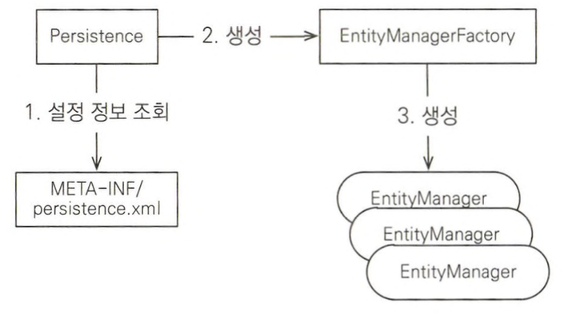

> 이전 내용은 개발환경 세팅이라 생략
> 

# 2.4 객체 매핑 시작

- 매핑 어노테이션
    - @Entity: 이 클래스를 테이블과 매핑함
        - 엔티티 클래스: @Entity가 사용된 클래스
    - @Table: 엔티티 클래스에 매핑할 테이블 정보를 알려줌
        - name 속성을 생략하면 클래스 이름을 테이블 이름으로 매핑
    - @Id: 엔티티 클래스의 필드를 테이블의 기본 키에 매핑함
        - 식별자 필드: @Id를 사용된 필드
    - @Column: 필드를 열에 매핑
        - 매핑 정보가 없으면 name 속성을 이용해 명시적으로 매핑해야함

# 2.5 persistence.xml

## 2.5.1 데이터베이스 방언

- 데이터베이스 방언: JPA에서 SQL 표준을 지키지 않거나 특정 DB만의 고유한 기능
    - 가변 문자 타입
        - MySQL: `VARCHAR`
        - ORACLE: `VARCHAR2`
    - 문자열을 자르는 함수
        - SQL 표준: `SUBSTRING()`
        - ORACLE: `SUBSTR()`
    - 페이징 처리
        - MySQL: `LIMIT`
        - ORACLE: `ROWNUM`
    - DB방언을 많이 사용하면 나중에 DB를 교체하기가 어려움
        - 대부분의 JPA 구현체들은 DB방언 클래스를 제공해 이러한 문제를 해결
            - H2: `org.hibernate.dialect.H2Dialect`
            - ORACLE 10g: `org.hibernate.dialect.Oracle10gDialect`
            - MySQL: `org.hibernate.dialect.MySQL5InnoDBDialect`

# 2.6 애플리케이션 개발

## 2.6.1 엔티티 매니저 설정

## 2.6.2 트랜잭션 관리

- 트랜잭션 없이 데이터를 변경하면 예외 발생
- 트랜잭션을 시작하려면 엔티티 매니저에서 트랜잭션 API를 받아와야함
    - 트랜잭션 API를 이용해 비즈니스 로직이 정상 동작하면 트랜잭션을 커밋
    - 예외가 발생하면 트랜잭션을 롤백

## 2.6.3 비즈니스 로직

## 2.6.4 JPQL

- JPQL: 애플리케이션이 필요한 데이터만 DB에서 불러오도록 하는 검색 조건이 포함된 SQL
    - SQL을 추상화한 객체지향 쿼리언어
    - DB 테이블을 전혀 알지 못함
- JPQL와 SQL의 차이
    - JPQL: 엔티티 객체를 대상으로 쿼리 → 클래스와 필드를 대상으로 쿼리
    - SQL: DB 테이블을 대상으로 쿼리