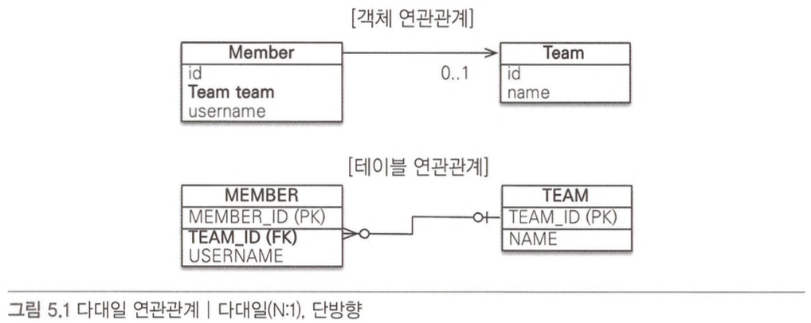
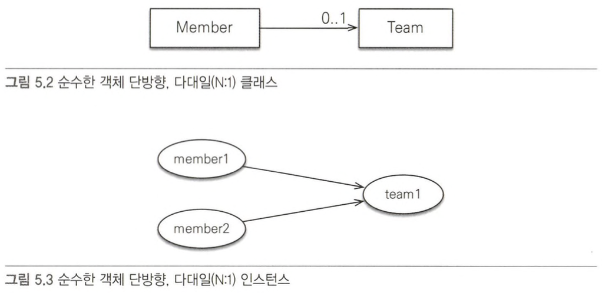
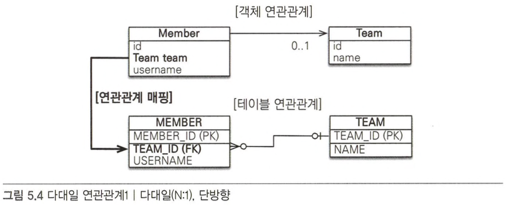
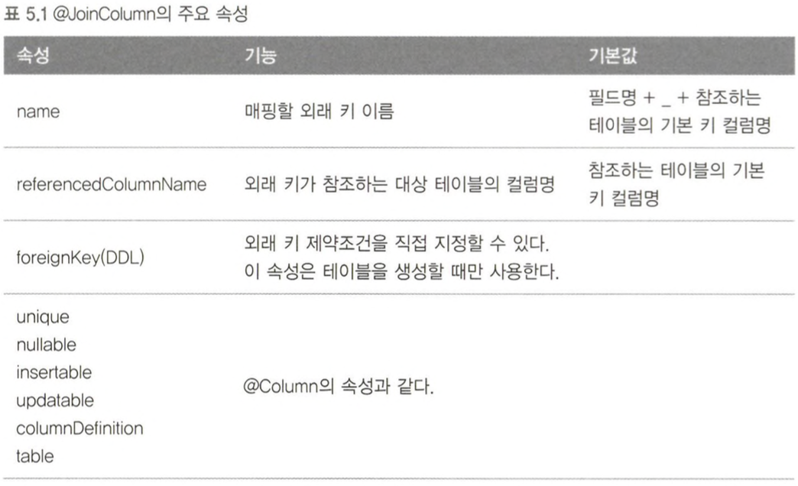
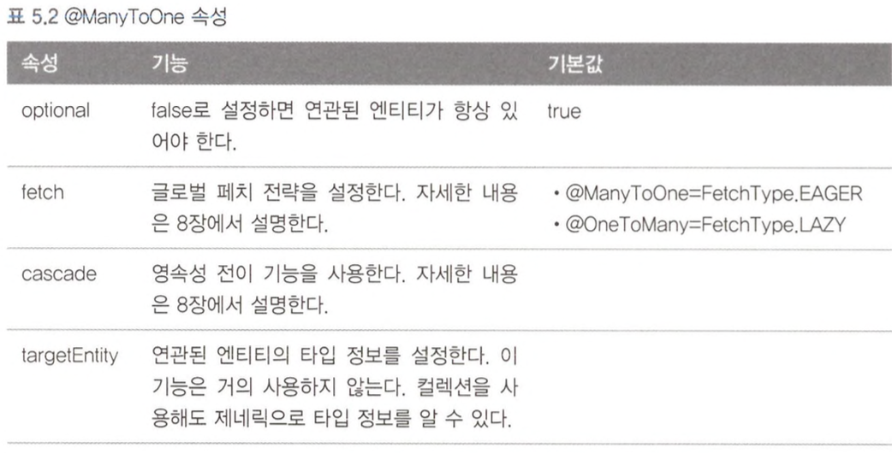
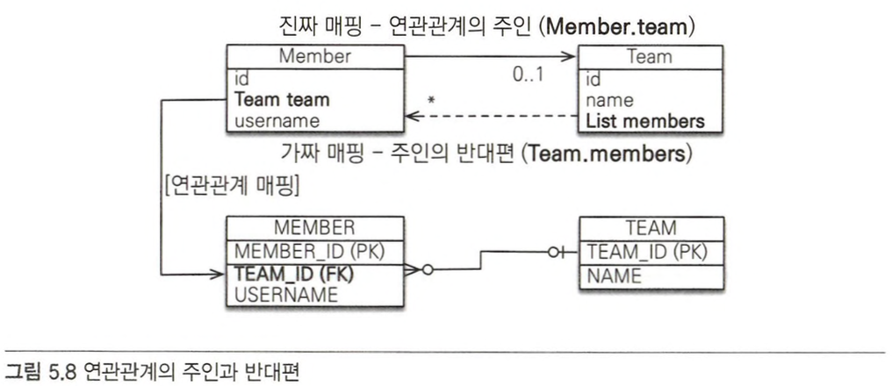

# 5.1 단방향 연관관계

- 다대일(N:1) 단반향 관계 예제
    - 회원과 팀이 있다.
    - 회원은 하나의 팀에만 소속될 수 있다.
    - 회원과 팀은 다대일 관계이다.
    
    
    
    - 객체 연관 관계
        - 회원 객체는 `Member.team`필드로 팀 객체와 연관관계를 가짐
        - 회원 객체와 팀 객체는 단방향 관계
            - `member` → `team`은 가능하지만 `team` → `member`는 불가능
    - 데이블 연관 관계
        - 회원 태이블은 `TEAM_ID` 외래 키로 팀 테이블과 연관관계를 맺음
        - 회원 테이블과 팀 테이블은 양방향 관계
            - 회원 테이블의 `TEAM_ID` 외래 키를 통해서 `MEMBER JOIN TEAM`과 T`EAM JOIN MEMBER` 둘 다 가능
    - 객체 연관 관계와 테이블 연관관계의 가장 큰 차이
        - 참조를 통한 연관관계는 언제나 단방향
            - 양방향으로 만들기 위해서는 반대쪽에도 필드를 추가해 참조를 보관해야 함
                - 연관관계를 하나 더 만드는 것 (굳이 따지면, 양방향이 아니라, 단방향 2개임)
        - 양방향 연관관계: 양쪽에서 서로 참조하는 연관관계
        - 테이블은 외래 키 하나로 양방향으로 조인할 수 있음
    - 객체 연관관계 vs 테이블 연관관계
        - 연관관계를 맺는 수단
            - 객체: 참조
            - 테이블: 외래키를 이용한 `JOIN`

## 5.1.1 순수한 객체 연관관계

- JPA를 사용하지 않는 순수한 회원과 팀 클래스의 코드

```java
public class Member {
	private String id;
	private String username;
	
	private Team team; // 팀의 참조를 보관
	
	public void setTeam(Team team) {
		this.team = team;
	}
	
	// Getter, Setter, etc...
}

public class Team {
	private String id;
	private String name;

	// Getter, Setter, etc...
}
```

- 회원1과 회원2를 팀1에 소속 시키는 코드

```java
public static void main(String[] args) {
	// 샘성자(id, 이름)
	Member member1 = new Member("member1", "회원1");
	Member member2 = new Member("member2", "회원2");
	Team team1 = new Team("team1", "팀1");
	
	member1.setTeam(tean1);
	member2.setTeam(team1);
	
	Team findTeam = member1.getTeam(); // 회원1이 속한 팀 조회: 객체 그래프 탐색
}
```

- 클래스와 인스턴스 관계



## 5.1.2 테이블 연관관계

- 회원 테이블과 팀 테이블의 DDL

```sql
CREATE TABLE MEMBER {
	MEMBER_ID VARCHAR(255) NOT NULL,
	TEAM_ID VARCHAR(255),
	USERNAME VARCHAR(255),
	PRIMARY KEY (MEMBER_ID)
}

CREATE TABLE TEAM {
	TEAM_ID VARCHAR(255) NOT NULL,
	NAME VARCHAR(255),
	PRIMARY KEY (TEAM_ID)
}

ALTER TABLE MEMBER ADD CONSTRAINT FK_MEMBER_TEAM
	FOREIGN KET (TEAM_ID)
	REFERENCES TEAM
```

- 회원1과 회원2를 팀1에 소속 시키는 SQL

```sql
INSERT INTO TEAM(TEAM_ID, NAME) VALUES('team1','팀1');
INSERT INTO MAMBER(MEMBER_ID, TEAM_ID, USERNAME)
VALUES ('member1', 'team1', '회원1');
INSERT INTO MAMBER(MEMBER_ID, TEAM_ID, USERNAME)
VALUES ('member2', 'team1', '회원2');
```

- 조인(`JOIN`): DB에서 외래 키를 사용해서 연관관계를 탐색

```sql
SELECT T.*
FROM MEMBER M
	JOIN TEAM T ON M.TEAM_ID = T.TEAM=ID
WHERE M.MEMBER_ID = 'member1'
```

## 5.1.3 객체 관계 매핑

- JPA를 사용해서 매핑



- 객체 연관관계: 회원 객체의 `Member.team` 필드 사용
- 테이블 연관관계: 회원 테이블의 `MEMBER.TEAM_ID` 왜래키 컬럼을 사용

```java
@Entity
public class Member {
	@Id
	@column(name = "MEMBER_ID")
	private String id;
	
	private String username;
	
	// 연관관계 매핑
	@ManyToOne
	@JoinColumn(name="TEAM_ID")
	private Team team;
	
	// 연관관계 설정
	public void setTeam(Team team) {
		this.team = team;
	}
	
	// Getter, Setter, etc...
```

```java
@Entity
public class Team {
	@Id
	@Column(name = "TEAM_ID")
	private String id;
		
	private String name;
		
	// Getter, Setter, etc...
}
```

- 연관관계 매핑: `Member.team` 과 `MEMBER.TEAM_ID` 를 매핑하는 것이 연관관계 매핑

```java
@ManyToOne
@JoinColumn(name="TEAM_ID")
private Team team;
```

## 5.1.4 `@JoinColumn`

- 외래 키를 매핑할 때 사용함
- 생략하면 외래 키를 찾을 때 기본 전략을 사용
    - (필드명) _(참조하는 테이블의 컬럼명)



## 5.1.5 `@ManyToOne`

- 다대일(N:1) 관계에서 사용함



# 5.2 연관관계 사용

## 5.2.1 저장

```java
public void testSave() {
	// 팀1 저장
	Team team1 = new Team("team1", "팀1");
	em.persist(team1);
	
	//회원1 저장
	Member member1 = new Member("member1", "회원1");
	member.setTeam(team1) // 연관관계 설정 member1 -> team1
	em.persist(member1);

	//회원2 저장
	Member member1 = new Member("member2", "회원2");
	member.setTeam(team1) // 연관관계 설정 member2 -> team1
	em.persist(member2);
```

- JPA에서 엔티티를 저장할 때 연관된 모든 엔티티는 영속 상태여야 함
- JPA는 참조한 팀의 식별자를 외래 키로 사용해 적절한 등록 쿼리를 생성

## 5.2.2 조회

- 연관관계가 있는 엔티티를 조회하는 방법
    - 객체 그래프 탐색 (객체 연관관계를 사용한 조회)
    
    ```java
    Member member = em.find(Member.class, "member1");
    Team team = member.getTeam(); // 객체 그래프 탐색
    System.out.println("팀 이름 = " + team.getName());
    ```
    
    - 객체지향 쿼리 사용(JPQL)
    
    ```java
    private static void queryLogicJoin(EntityManager em) {
    	String jpql = "select m from Member m join m.team t where " +
    		"t.name=:teamName";
    		
    	List<Member> resultList = em.createQuert(jpql, Member.class)
    		.setParameter("teamName", "팀1");
    		.getResultList();
    	
    	for (Member member : resultList) {
    		System.out.println("[query] member.username=" +
    			member.getUsername());
    	}
    }
    ```
    
- `:teamName`: 파라미터 파인딩

```sql
// 파라미터 바인딩을 이용한 JPQL
select m from Member m join m.team t
where t.name=:teamName;

// 실제로 실행되는 SQL
SELECT M.* FROM MEMBER MEMBER
INNER JOIN
	TEAM TEAM ON MEMBER.TEAM_ID = TEAM1_.ID
WHERE
	TEAM1_.NAME='팀1';
```

## 5.2.3 수정

```java
private static void updateRelation(EntityManager em) {
	// 새로운 팀2
	Team team2 - new Team("team2", "팀2");
	em.persist(team2);
	
	//회원1에 새로운 팀2 설정
	Member member = em.find(Member.class, "member1");
	member.setTeam(team2);
}
```

- 실행되는 SQL

```sql
UPDATE MEMBER
SET
	TEAM_ID='team2', ...
WHERE
	ID='member1';
```

- 단순히 불러온 엔티티의 값만 변경해두면 트랜잭션을 커밋할 때 플러시가 일어나면서 변경 감지 기능이 작동함 → 변경사항을 DB에 자동으로 반영
- 연관관계를 수정할 때도 같음
    - 참조하는 대상만 변경하면 나머지는 JPA가 자동으로 처리

## 5.2.4 연관관계 제거

```java
private static void deleteRelation(EntityManager em) {
	Member member1 = em.find(Member.class, "member1");
	member1.setTeam(null); // 연관관계 제거
}
```

- 실행되는 SQL

```sql
UPDATE MEMBER
SET
	TEAM_ID=null, ...
WHERE
	ID='member1';
```

## 5.2.5 연관된 엔티티 삭제

- 연관된 엔티티를 삭제하려면 기존에 있던 연관관계를 먼저 제거하고 삭제해야함
    - 외래 키 재약조건으로 인해 DB에서 오류가 발생하는걸 방지하기 위함
- ex) 팀1에는 회원1과 회원2가 소속되어 있다.
    - 팀1을 삭제하기 위해서는 연관관계를 먼저 끊어야함

```java
member1.setTeam(null); // 회원1 연관관계 제거
member2.setTeam(null); // 회원2 연관관계 제거
em.remove(team); // 팀 삭제
```

# 5.3 양방향 연관관계

- 객체 연관관계


- 일대다 관계는 여러 건과 연관관계를 맺을 수 있으므로 컬렉션을 사용해야 함
    - JPA는 List를 포함해서 Collection, Set, Map 같은 다양한 컬렉션을 지원 함
- 객체 연관관계 정리
    - 회원 → 팀: `Member.team`
    - 팀 → 회원: `Team.members`
- 테이블의 연관관계


## 5.3.1 양방향 연관관계 매핑

- 매핑한 회원 엔티티

```java
@Entity
public class Member {
	@Id
	@Column(name = "MEMBER_ID")
	private String id;
	
	private String username;
	
	@ManyToOne
	@JoinColumn(name=”TEAM_ID")
	private Team team;
	
	//연관관계 설정
	public void setTeam(Team team) {
		this.team = team;
	}
	
	// Getter, Setter, etc...
}
```

- 매핑한 팀 엔티티

```java
@Entity
pub丄ic class Team {
	@Id
	@column(name = "TEAM_ID")
	private String id;
	
	private String name;
	
	//==추가 ==//
	@0neToMany(mappedBy = "team")
	private List<Member> members = new ArrayList<Member>();
	
	// Getter, Setter, etc...
}
```

## 5.3.2 일대다 컬렉션 조회

```java
public void biDirection() {
	Team team = em.find(Team.class, "teaml");
	List<Member> members = team. getMembers (); //(팀 -> 회원), 객체 그래프 탐색

	for (Member member : members) {
		System.out.println("member.username = " + member.getUsername());
	}
}
```

# 5.4 연관관계의 주인

- 객채에서의 양방향 연관관계: 서로 다른 단방향 연관관계 2개를 애플리케이션 로직으로 잘 묶어서 양방향인 것처럼 보이게 한 것
    - 회원 → 팀 (단방향)
    - 팀 → 회원 (단뱡항)
- DB에서의 양방향 연관관계: 외래 키 하나만으로 맺을 수 있음
    - 회원 ↔ 팀 (양방향)
- 테이블은 외래 키 하나로 두 테이블의 연관관계를 관리
- 엔티티를 단방향으로 매핑하면 참조를 하나만 사용
    - 이 참조로 외래 키를 관리하면 됨
- 엔티티를 양방으로 매핑하면 두 곳에서 서로를 참조함
    - 객체의 연관관계를 관리하는 포인트는 2곳으로 늘어남
- 엔티티를 양방향 연관관계로 설정하면 객체의 참조는 둘인데 외래 키는 하나이므로, 둘 사이에 차이가 발생함
    - 연관관계의 주인: JPA에서 두 객체 연관관계 중 하나를 정해 테이블의 외래 키를 관리

## 5.4.1 양방향 매핑의 규칙: 연관관계의 주인

- 양방향 연관관계 매핑 시 지켜야 항 규칙: 두 연관관계 중 하나를 연관관계의 주인으로 정해야 함
    - 연관관계 주인만이 DB 연관관계와 매핑되고 외래 키를 관리할 수 있음
    - 주인이 아닌 쪽은 읽기만 할 수 있음
- `mappedBy` 속성을 통해 연관관계의 주인을 지정
    - 주인이 아닌 쪽에 사용하면 됨 (`@OneToMany`)

```java
class Member {
	@ManyToOne
	@JoinColumn(name="TEAM_ID")
	private Team team;
	...
}
```

- 연관관계의 주인을 정함 → 외래 키 관리자를 선택함

## 5.4.2 연관관계의 주인은 외래 키가 있는 곳

- 연관관계의 주인은 테이블에 외래 키가 있는 곳으로 정해야 함
    - `@ManyToOne`은 항상 연관관계의 주인이 됨



```java
class Team {
	@OneToMany(mappedBy="team") // MappedBy 속성의 값은 연관관계 주인인 Member.team
	private List<Member members = new ArrayList<Member>();
	...
}
```

- 연관관계 주인만 DB 연관관계와 매핑되고 외래 키를 관리할 수 있음
- 주인이 아닌 반대편은 읽기만 가능하고 외래키를 변경하지는 못함

# 5.5 양뱡향 연관관계 저장

- 양방향 연관관계를 사용해 팀1, 회원1, 회원2를 저장

```java
public void testSave() {
	// 팀1 저장
	Team team1 = new Team("team1", "팀1");
	em.persist(team1);
	
	// 회원1 저장
	Member member1 = new Member ("member1", "회원1");
	member1.setTeam(team1); // 연관관계 설정 member1 -> team1
	em.persist(member1);
	
	// 회원1 저장
	Member member2 = new Member ("member2", "회원2");
	member2.setTeam(team1); // 연관관계 설정 member2 -> team1
	em.persist(member2);
}
```

- 양방향 연관관계는 연관관계의 주인이 외래 키를 관리하기 때문에 주인이 아닌 방향은 값을 설정하지 않아도 DB에 외래 키 값이 정상 입력됨
- 주인이 아닌 곳에 입력된 값은 외래 키에 영향을 주지 않음

# 5.6 양뱡향 연관관계의 주의점

- 양방향 연관관계를 설정하고 가장 흔히 하는 실수: 연관관계의 주인에는 값을 인력하지 않고 주인이 아닌 곳에만 값을 입력하는 것

## 5.6.1 순수한 객체까지 고려한 양방향 연관관계

- 객체 관점에서 양쪽 방향에 모두 값을 입력해주는 것이 가장 안전함
    - JPA를 사용하지 않는 순수한 객체 상태에서 심각한 문제가 발생할 수 있음

## 5.6.2 연관관계 편의 메소드

- 양방향 연관관계에서 양쪽 메소드는 하나인 것처럼 사용하는 것이 안전함
    - 실수로 둘 둥 하나만 호출해서 양방향이 깨질 수 있음

## 5.6.3 연관관계 편의 메소드 작성 시 주의사항

- 연관관계를 변경할 때는 기존 관계를 제거하도록 해야함