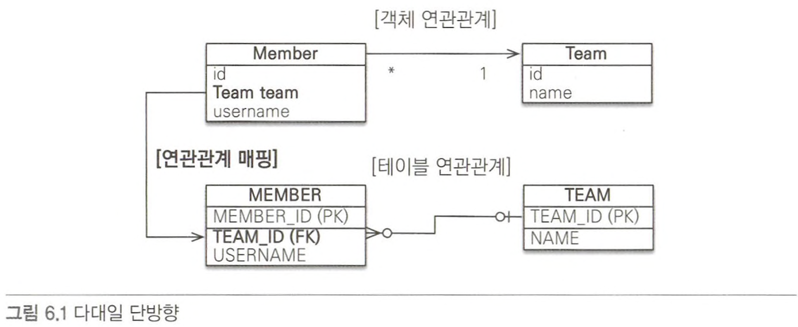
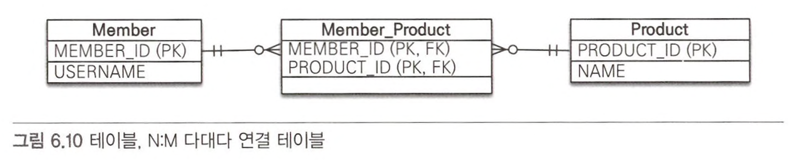

# 6.0 5장 복습

- 엔티티의 연관관계를 매핑할 때 고려사항
    - 다중성
        - 다대일
        - 일대다
        - 일대일
        - 다대다
    - 단방향, 양방향
    - 연관관계의 주인
- 가능한 모든 연관관계
    - 다대일: 단방향, 양방향
    - 일대다: 단방향, 양방향
    - 일대일: 주 테이블 단방향, 양방향
    - 일대일: 대상 테이블 단방향, 양방향
    - 다대다: 단방향, 양방향

# 6.1 다대일

- 다대일 ↔ 일대다
- 외래 키는 항상 다쪽에 있음
    - 객체 양방향 관계에서 연관관계의 주인은 항상 다쪽

## 6.1.1 다대일 단방향 [N:1]



```java
@Entity
public class Member {
	@Id @GeneratedValue
	@Column (name = "MEMBER_ID")
	private Long id;
	
	private String username;
	
	@ManyToOne
	@JoinColumn(name = "TEAM_ID")
	private Team team;
	
	// Getter, Setter, Etc...
}
```

```java
@Entity
public class Team {
	@Id @GeneratedValue
	@Column (name = "TEAM_ID")
	private Long id;
	
	private String name;
	
	// Getter, Setter, Etc...
}
```

- 회원은 `Member.team`으로 팀 엔티티를 참조할 수 있지만, 반대로 팀에는 회원을 참조하는 필드가 없으므로 회원과 팁은 다대일 단방향 연관관계

```java
@ManyToOne
@JoinColumn(name = "TEAM_ID") // Member.team 필드를 TEAM_ID 왜래 키와 매핑
private Team team;
```

## 6.1.2 다대일 양방향  [N:1, 1:N]


- 실선이 연관관계의 주인(`Member.team`)

```java
@Entity
public class Member {
	@Id @GeneratedValue
	@Column (name = "MEMBER_ID")
	private Long id;
	
	private String username;
	
	@ManyToOne
	@JoinColumn(name = "TEAM_ID")
	private Team team;
	
	public void setTeam(Team team) {
		this.team = team;
		
		// 무한루프 빠지지 않도록 체크
		if(!team.getMembers().contains(this)) {
			team.getMembers().add(this);
		}
	}
}
```

```java
@Entity
public class Team {
	@Id @GeneratedValue
	@Column (name = "TEAM_ID")
	private Long id;
	
	private String name;
	
	@OneToMany (mappedBy = "team")
	private List<Member> members = new ArrayList<Member>();
	
	public void addMember (Member member) {
		this.members.add(member);
		// 무한루프에 빠지지 안도록 체크
		if(members.getTeam() != this) {
			member.setTeam(this);
		}
	}
}
```

- 양방향은 왜래 키가 있는 쪽이 연관관계의 주인임
    - 일대다와 다대일 연관관계는 항상 다(N)에 외래 키가 있음
    - JPA는 왜래 키를 관리할 때 연관관계의 주인만 사용함
    - 주인이 아닌 Team.members는 조회를 위한 JPQL이나 객체 그래프를 탐색할 때 사용함
- 양방향 연관관계는 항상 서로를 참조해야 함
    - 어느 한 쪽만 참조하면 양방향 연관관계가 성립하지 않음
    - 항상 서로 참조하게 하려면 연관관계 편의 메소드를 작성하는 것이 좋음
    - 편의 메소드는 한 곳에만 작성해야함

# 6.2 일대다

- 일대다 ↔ 다대일
- 엔티티를 하나 이상 참조 할 수 있으므로 자바 컬렉션인 `Collection`, `List`, `Set`, `Map` 중에 하나를 사용해야 함

## 6.2.1 일대다 단방향 [1:N]

- 하나의 팀은 여러 회원을 참조할 수 있는데 이런 관계를 일대다 관계라고 함
- 팀은 회원들은 참조하지만 반대로 회원은 팀을 참조하지 않으면 둘의 관계는 단방향


- 보통 자신이 매핑한 테이블의 외래 키를 관리하는데, 이 매핑은 반대쪽 테이블에 있는 외래 키를 관리함
- 일대다 관계에서 외래 키는 항상 다쪽 테이블에 있음

```java
@Entity
public class Team {
	@Id @GeneratedValue
	@Column (name = "TEAM_ID")
	private Long id;
	
	private String name;
	
	@OneToMany
	@JoinColumn (name = "TEAM_ID") // Member 테이블의 TEAM_ID (FK)
	private List<Member> members = new ArrayList<Member>();
	
	// Getter, Setter, Etc...
}
```

```java
@Entity
public class Member {
	@Id @GeneratedValue
	@Column (name = "MEMBER_ID")
	private Long id;
	
	private String username;
	
	// Getter, Setter, Etc...
}
```

- 일대다 단반향 관계를 매핑할 때는 `@JoinColumn`을 명시해야 함
    - 그렇지 않으면 JPA는 연결 테이블을 중간에 두고 연관관계를 관리하는 조인 테이블 전략을 기본으로 사용해 매핑함
- 일대다 단방향 매핑의 단점
    - 객체가 관리하는 외래 키가 다른 테이블에 있음
    - 본인 테이블에 외래 키가 있으면 엔티티의 저장과 연관관계 처리를 `INSERT SQL` 한 번으로 끝낼 수 있지만, 다른 테이블에 외래 키가 있으면 연관관계 처리를 위한 `UPDATE SQL`을 추가로 실행해야 함
    
    ```java
    public void testSave() {
    	Member member1 = new Member("member1");
    	Member member2 = new Member("member2");
    	
    	Team team1 = new Team("team1");
    	team1.getMembers().add(member1);
    	team1.getMembers().add(member2);
    	
    	em.persist(member1); // INSERT-member1
    	em.persist(member2); // INSERT-member2
    	em.persist(team1); // INSERT-team1, UPDATE-member1.fk, UPDATE-member2.fk
    	transaction.commit();
    }
    ```
    
- 위의 코드를 실행하면 다음과 같은 SQL이 실행됨

```sql
insert into Member (MEMBER_ID, username) values (null, ?)
insert into Member (MEMBER_ID, username) values (null, ?)
insert into Team (TEAM_ID, name) values (null, ?)
update Member set TEAM_ID=? where MEMBER_ID=?
update Member set TEAM_ID=? where MEMBER_ID=?
```

- 연관관계에 대한 정보는 `Team`엔티티 `members`가 관리함
    - `Member`엔티티를 저장할 때는 `MEMBER` 테이블의 `TEAM_ID` 외래 키에 아무 값도 저장되지 않음
    - `Team` 엔티티를 저장할 때 `Team.members`의 참조 값을 확인해서 회원 테이블에 있는 `TEAM_ID` 외래 키를 업데이트함
- 일대다 단방향 매핑보다는 다대일 양방향 매핑을 사용하자
    - 일대다 단방향 매핑을 사용하면 엔티티를 매핑한 테이블이 아닌 다른 테이블의 외래 키를 관리해야 함
        - 성능 문제와 부담스러운 관리 때문
        - 일대다 단방향 매핑 대신에 다대일 양방향 매핑을 사용하면 해결 할 수 있음
        - 다대일 양방향 매핑은 관리해야 하는 외래 키가 본인 테이블에 있음
            - 일대다 단방향 매핑 같은 문제가 발생하지 않음
    - 일대다 단방향 매핑 보다는 다대일 양방향 매핑을 권장함

## 6.2.2 일대다 양방향 [1:N, N:1]

- 일대다 양방향 매핑을 존재하지 않음
    - 다대일 양방향 매핑을 사용해야함
- 양방향 매핑에서 `@OneToMany`는 연관관계의 주인이 될 수 없음
    - 관계형 DB의 특성상 일대다, 다대일 관계는 항상 다 쪽에 외래 키가 있음
        - `@OneToMany`, `@ManyToOne` 둘 중에 연관관계의 주인은 항상 다 쪽인 `@ManyToOne`을 사용한 곳임
        - `@ManyToOne`에는 `mappedBy` 속성이 없음
- 일대다 양방향 매핑이 완전히 불가능한 것은 아님
    - 일대다 단방향 매핑 반대편에 같은 외래 키를 사용하는 다대일 단방향 매핑을 읽기 전용으로 하나 추가하면 됨


```java
@Entity
public class Team {
	@Id @GenerateValue
	@Column(name = "TEAM_ID")
	private Long id;
	
	private String name;
	
	@OneToMany
	@JaoinColumn(name = "TEAM_ID")
	private List<Member> members = new ArrayList<Member>();
	
	// Getter, Setter, Etc ...
}
```

```java
@Entity
public class Member {
	@Id @GeneratedValue
	@Column (name = "MEMBER_ID")
	private Long id;
	private String username;
	
	@ManyToOne
	@JoinColumn(name = "TEAM_ID", insertable = false, updatable = false)
	private Team team;
		
	// Getter, Setter, Etc ...
}
```

- 일대다 단방향 매핑 반대편에 다대일 단방향 매핑을 추가했음
    - 일대다 단방향 매핑과 같은 `TEAM_ID` 외래 키 컬럼을 매핑했음
    - 이럴 경우 둘 다 같은 키를 관리하므로 문제가 발생할 수 있음
        - 반대편인 다대일 쪽은 `insertable = false`, `updatable = false`로 설정해서 읽기만 가능하게 함
            - 일대다 양방향 매핑이라기보다는 일대다 단방향 매핑 반대편에 다애일 단방향 매핑을 읽기 전용으로 추가해서 일대다 양방향처럼 보이도록 하는 방법
            - 일대다 단방향 매핑이 가지는 단점을 그대로 가짐
- 될 수 있으면 다대일 양방향 매핑을 사용하자

# 6.3 일대일 [1:1]

- 일대일 관계는 양쪽이 서로 하나의 관계만 가짐
- 일대일 관계는 그 반대도 일대일 관계
- 테이블 관계에서 일대다, 다대일은 항상 다(N)쪽이 외래 키를 가짐
- 반면에 일대일 관계는 주 테이블이나 대상 테이블 둘 중 어느 곳이나 외래 키를 가질 수 있음
- 테이블은 주 테이블이든 대상 테이블이든 외래 키 하나만 있으면 양쪽으로 조회할 수 있음
- 일대일 관계는 주 테이블이나 대상 테이블 중에 누가 외래 키를 가질지 선택해야 함
    - 주 테이블에 외래 키
        - 주 객체가 대상 객체를 참조하는 것처럼 주 테이블에 외래 키를 두고 대상 테이블을 참조함
        - 외래 키를 객체 참조와 비슷하게 사용할 수 있어서 객체지향 개발자들이 선호
        - 주 테이블이 외래 키를 가지고 있으므로 주 테이블만 확인해도 대상 테이블과 연관관계가 있는 지 알 수 있음
    - 대상 테이블에 외래 키
        - 전통적인 DB 개발자들은 보통 대상 테이블에 외래 키를 두는 것을 선호함
        - 테이블 관계를 일대일에서 일대다로 변경할 때 테이블 구조를 그대로 유지할 수 있음

## 6.3.1 주 테이블에 외래 키

- JPA는 주 테이블에 외래 키각 있으면 좀 더 편리하게 매핑할 수 있음

### 단방향


```java
@Entity
public class Member {
	@Id @GeneratedValue
	@Column (name = "MEMBER_ID")
	private Long id;
	
	private String username;
	
	@OneToOne
	@JoinColumn(name = "LOCKER_ID")
	private Locker locker;
		
	// Getter, Setter, Etc ...
}

@Entity
public class Locker {
	@Id @GeneratedValue
	@Column (name = "LOCKER_ID")
	private Long id;
	
	private String name;
	
	// Getter, Setter, Etc ...
}
```

- 일대일 관계이므로 객체 매핑에 `@oneToOne`을 사용했고 DB에는 `LOCKER_ID` 외래 키에 유니크 제약 조건을 추가했음
- 이 관계는 다대일 단반향과 거의 비슷함

### 양방향


```java
@Entity
public class Member {
	@Id @GeneratedValue
	@Column (name = "MEMBER_ID")
	private Long id;
	
	private String username;
	
	@OneToOne
	@JoinColumn(name = "LOCKER_ID")
	private Locker locker;
		
	// Getter, Setter, Etc ...
}

@Entity
public class Locker {
	@Id @GeneratedValue
	@Column (name = "LOCKER_ID")
	private Long id;
	
	private String name;
	
	@OneToOne(mappedBy = "locker")
	private Member member;
	
	// Getter, Setter, Etc ...
}
```

- 양방향이므로 연관관계의 주인을 정해야 함
- `MEMBER` 테이블이 외래 키를 가지고 있으므로 `Member` 엔티티에 있는 `Member.locker`가 연관관계의 주인
- 반대 매핑인 사물함의 `Locker.member`는 `mappedBy`를 선언해서 연관관계의 주인이 아니라고 설정함

## 6.3.2 대상 테이블에 외래 키

### 단방향


- 외래 키가 있는 단방향 관계는 JPA에서 지원하지 않고 매핑할 수 있는 방법도 없음
    - 단방향 관계를 `Locker`에서 `Member` 방향으로 수정하거나, 양방향 관계로 만들고 `Locker`를 연관관계의 주인으로 설정해야 함
- JPA 2.0부터 일대다 단방향 관계에서 대상 테이블에 외래 키가 있는 매핑을 허용했음
    - 일대일 단방향은 이런 매핑을 허용하지 않음

### 양방향


```java
@Entity
public class Member {
	@Id @GeneratedValue
	@Column (name = "MEMBER_ID")
	private Long id;
	
	private String username;
	
	@OneToOne(mappedBy = "member")
	private Locker locker;
		
	// Getter, Setter, Etc ...
}

@Entity
public class Locker {
	@Id @GeneratedValue
	@Column (name = "LOCKER_ID")
	private Long id;
	
	private String name;
	
	@OneToOne
	@JoinColumn(name = "MEMBER_ID")
	private Member member;
	
	// Getter, Setter, Etc ...
}
```

- 일대일 매핑에서 대상 테이블에 외래키를 두고 싶으면 양방향으로 매핑함
- 주 엔티티인 `Member` 엔티티 대신에 대상 엔티티인 `Locker`를 연관관계의 주인으로 만들어서 `LOCKER` 테이블의 외래 키를 관리하도록 했음

# 6.4 다대다 [N:N]

- 관계형 DB는 정규화된 테이블 2개로 다대다 관계를 표현할 수 없음
    - 보통 다대다 관계를 일대다, 다대일 관계로 풀어내는 연결 테이블을 사용함
- ex)
    - 회원들은 상품을 주문함
    - 반대로 상품들은 회원들에 의해 주문됨
    - 둘은 다대다 관계
        - 회원 테이블과 상품 테이블만으로는 이 관계를 표현할 수 없음
    
    
    
- 연결 테이블을 추가해야함
    - Member_Product 연결 테이블을 추가함
        - 이 테이블을 사용해 다대다 관계를 일대다, 다대일 관계로 풀어낼 수 있음
        - 이 연결 테이블은 회원이 주문한 상품을 나타냄
    
    
    
- 객체는 테이블과 다르게 객체 2개로 다대다 관계를 만들 수 있음
    - ex) 회원 객체는 컬렉션을 사용해 상품들을 참조하면 되고 반대로 상품들도 컬렉션을 사용해 회원들을 참조하면 됨
    - @ManyToMany를 사용하면 이런 다대다 관계를 편리하게 매핑할 수 있음
    
    
    

## 6.4.1 다대다: 단방향

```java
@Entity
public class Member {
	@Id @Column (name = "MEMBER_ID")
	private Long id;
	
	private String username;
	
	@ManyToMany
	@JoinTable(name = "MEMBER_PRODUCT",
						joinColumns = @JoinColumn = "MEMBER_ID"),
						inverseJoinColumns = @JoinColumn(name = "PRODUCT_ID"))	
	private List<Product> products = new ArrayList<Product>():
		
	// Getter, Setter, Etc ...
}
```

```java
@Entity
public class Product {
	@Id @Column(name = "PRODUCT_ID")
	private String id;
	
	private String name;
	
	// Getter, Setter, Etc ...
}
```

- 회원 엔티티와 상품 엔티티를 `@ManyToMany`로 매핑
    - `@ManyToMany`와 `@JoinTable`을 사용해서 연결 테이블을 바로 매핑한 것
        - 회원과 상품을 연결하는 회원_상품(`Member_Product`) 엔티티 없이 매핑을 완료할 수 있음
- 연결 테이블을 매핑하는 `@JoinTable`의 속성
    - `@JoinTable.name`: 연결테이블을 지정
    - `@JoinTable.joinColumns`: 현재 방향인 회원과 매핑할 조인 컬럼 정보를 지정
    - `@JoinTable.inverseJoinColumns`: 반대 방향인 상품과 매핑할 조인 컬럼 정보를 지정
- `MEMBER_PRODUCT` 테이블은 다대다 관계를 일대다, 다대일 관계로 풀어내기 위해 필요한 연결 테이블일 뿐임
    - `@ManyToMany`로 매핑한 덕분에 다대다 관계를 사용할 때는 이 연결 테이블을 신경쓰지 않아도 됨

```java
public void save() {
	Product productA = new Product();
	productA.setId("productA");
	productA.setName("상품A");
	em.persist(productA);
	
	Member member1 = new Member();
	member1.setId("member1");
	member1.setUsername("회원1");
	member1.getProducts().add(productA); // 연관관계 설정
	em.persist(member1);
}
```

- 회원1과 상품A의 연관관계를 설정했으므로 회원1을 저장할 때 연결 테이블에도 값이 저장됨
    - 이 코드를 실행하면 실행되는 SQL코드
    
    ```sql
    INSERT INTO PRODUCT ...
    INSERT INTO MEMBER ...
    INSERT INTO MEMBER_PRODUCT ...
    ```
    

```java
public void find() {
	Member member = em.find(Member.class, "member1");
	List<Product> products = member.getProducts(); // 객체 그래프 탐색
	
	for(Product product : products) {
		System.out.println("product.name = " + product.getName());
	}
}
```

- 순서대로 저장한 후에 탐색해보면 저장해두었던 상품1이 조회됨
- `member.getProducts()`를 호출해 상품 이름을 출력하면 다음 SQL이 실행됨

```sql
SELECT * FROM MEMBER_PRODUCT MP
INNER JOIN PRODUCT P ON MP.PRODUCT_ID = P.PRODUCT_ID
WHERE MP.MEMBER_ID=?
```

- 실행된 SQL을 보면 연결 테이블인 `MEMBER_PRODUCT`와 상품 테이블을 조인해서 연관된 상품을 조히
- `@ManyToMany` 덕분에 복잡한 다대다 관계를 애플리케이션에서는 아주 단순하게 사용할 수 있음

## 6.4.2 다대다: 양방향

- 역방향도 `@ManyToMany`를 사용함
    - 양쪽 중 원하는 곳에 `mappedBy`로 연관관계의 주인을 지정
        - `mappedBy`가 없는 것이 연관관계의 주인

```java
@Entity
public class Product {
	@Id
	private String id;
	
	@ManyToMany(mappedBy = "products") // 역방향 추가
	private List<Member> members;
	
	// Getter, Setter, Etc ...
}
```

- 다대다의 양방향 관계는 다음처럼 설정하면 됨

```java
member.getProducts().add(product);
product.getMembers().add(member);
```

- 양방향 연관관계는 연관관계 편의 메소드를 추가해서 관리하는 것이 편리함
- 아래 코드 처럼 회원 엔티티에 연관관계 편의 메소드를 추가하면 됨

```java
public void addProduct(Product product) {
	...
	products.add(product);
	product.getMembers().add(this);
}
```

- 연관관계 편의 메소드를 추가했으므로 다음처럼 간단히 양방향 연관관계를 설정하면 됨

```java
member.addProdcut(product);
```

- 양방향 연관관계로 만들었으므로 `product.getMembers()`를 사용해 역방향으로 객체 그래프를 탐색할 수 있음

```java
public void findInverse() {
	Product product = em.find(Product.class, "productA");
	List<Member> members = product.getMembers();
	
	for(Member member : members) {
		System.out.println("member = " + member.getUsername());
	}
}
```

## 6.4.3 다대다: 매핑의 한계와 극복, 연결 엔티티 사용

- `@ManyToMany`를 사용하면 연결 테이블을 자동으로 처리해주므로 도메인 모델이 단순해지고 여러 가지로 편리함
    - 이 매핑을 실무에서 사용하기에는 한계가 있음
        - ex) 회원이 상품을 주문하면 연결 테이블에 단순히 주문한 회원 아이디와 상품 아이디만 담고 끝나지 않음
            - 보통은 연결 테이블에 주문 수량 컬럼이나 주문한 날짜 같은 컬럼이 더 필요함
        
        
        
        - 연결 테이블에 주문 수량(`ORDERAMOUT`)과 주문 날짜(`ORDERDATE`)컬럼을 추가함
            - 이렇게 컬럼을 추가하면 더는 `@ManyToMan`y를 사용할 수 없음
                - 주문 엔티티나 상픔 엔티티에는 추가한 칼럼들을 매핑할 수 없기 때문
                - 연결 테이블을 매핑하는 연결 엔티티를 만들고 이곳에 추가한 컬럼들을 매핑해야함
                - 엔티티간의 관계도 테이블 관계처럼 다대다에서 일대다, 다대일 관계로 풀어야함
                    - 여기서는 회원상품(MemberProduct) 엔티티를 추가함
                
                
                
        - 연결 테이블에 주문 수량(`ORDERAMOUT`)과 주문 날짜(`ORDERDATE`)컬럼을 추가했고 나머지 테이블은 기존과 같음
        
        ```java
        @Entity
        public class Member {
        	@Id @Column (name = "MEMBER_ID")
        	private Long id;
        	
        	// 역방향
        	@OneToMany(mapped = "member")
        	private List<MemberProduct> memberProducts;
        		
        	// Getter, Setter, Etc ...
        }
        ```
        
        - 회원과 회원상품을 양방향 관계로 만듦
        - 회원상품 엔티티 쪽이 외래 키를 가지고 있으므로 연관관계의 주인임
            - 연관관계의 주인이 아닌 회원의 `Member.memberProducts`에는 `mappedBy`를 사용함
        
        ```java
        @Entity
        public class Product {
        	@Id @Column(name = "PRODUCT_ID")
        	private String id;
        	
        	private String name;
        	
        	// Getter, Setter, Etc ...
        }
        ```
        
        - 상품 엔티티에서 회원 상품 엔티티로 객체 그래프 탐식 기능이 필요하지 않다고 판단해 연관관계를 만들지 않음
        - 가장 중요한 회원상품 엔티티와 회원 상품 식별자 클래스
        
        ```java
        @Entity
        @IdClass(MemberProductId.class)
        public class MemberProuct {
        	@Id
        	@ManyToOne
        	@JoinColumn(name = "MEMBER_ID")
        	private Member member; // MemberProductId.member와 연결
        	
        	@Id
        	@ManyToOne
        	@JoinColumn(name = "PRODUCT_ID")
        	private Product product; // MemberProductId.product와 연결
        	
        	private int orderAmount;
        	
        	// Getter, Setter, Etc ...
        }
        ```
        
        ```java
        public class MemberProductId implements Serializable {
        	private String member; // MemberProduct.member와 연결
        	private String product; // MemberProductId.product와 연결
        	
        	// hashCode and equals
        	
        	@Override
        	public boolean equals(Object o) {...}
        	
        	@Override
        	public int hashCode() {...}
        }
        ```
        
        - 회원상품(`MemberProduct`) 엔티티를 보면 기본 키를 매핑하는 `@Id`와 외래 키를 매핑하는 `@JoinColum`을 동시에 사용해 기본 키 + 외래 키를 한번에 매핑함
        - `@IdClass`를 사용해 복합 기본 키를 매핑함
- 복합 기본 키
    - 회원 상품 엔티티는 기본 키가 `MEMBER_ID`와 `PRODUCT_ID`로 이루어진 복합 기본키
    - JPA에서 복합 키를 사용하려면 별도의 식별자 클래스를 만들어야함
        - 엔티티에 `@IdClass`를 사용해 식별자 클래스를 지정하면 됨
            - `MemberProductId`클래스를 복합 키를 위한 식별자 클래스로 사용함
    - 복합 키를 위한 식별자 클래스의 특징
        - 복합 키는 별도의 식별자 클래스로 만들어야 함
        - `Serializable`을 구현해야 함
        - `equals`와 `hashCode` 메소드를 구현해야함
        - 기본 생성자가 있어야함
        - 식별자 클래스는 `public`이어야함
        - `@IdClass`를 사용하는 방법 외에 `@EmbeddedId`를 사용하는 방법도 있음
- 식별 관계
    - 회원 상품은 회원과 상품의 기본 키를 받아서 자신의 기본 키로 사용함
    - 식별 관계: 부모 테이블의 기본 키를 받아서 자신의 기본 키 + 외래 키로 사용하는 것
- 회원상품(`MemberProduct`)은 회원의 기본 키를 받아서 자신의 기본 키로 사용함과 동시에 회원과의 관계를 위한 외래 키로 사용함
- 상품의 기본 키도 받아서 자신의 기본 키로 사용함과 동시에 상품과의 관계를 위한 외래 키로 사용함
- `MemberProductId` 식별자 클래스로 두 기본 키를 묶어서 복함 기본 키로 사용함

```java
public void save() {
	// 회원 저장
	Member member1 = new Member();
	member1.setId("member1");
	member1.setUsername("회원1");
	em.persist(member1);
	
	// 상품 저장
	Product productA = new Product();
	productA.setId("productA");
	productA.setName("상품A");
	em.persist(productA);
	
	// 회원상품 저장
	MemberProduct memberProduct = new MemberProduct();
	memberProduct.setMember(member1) // 주문 회원 - 연관관계 설정
	memberProduct.setProduct(productA) // 주문 상품 - 연관관계 설정	
	memberProduct.setOrderAmout(2) // 주문수량
	
	em.persist(memberProduct);
}
```

- 회원상품 엔티티를 만들면서 연관된 회원 엔티티와 상품 엔티티를 설정
- 회원상품 엔티티는 DB에 저장될 때 연관된 회원의 식별자와 상품의 식별자를 가져와 자신의 기본 키 값으로 사용함

```java
public void find() {
	// 기본 키 값 생성
	MemberProductId memberProductId = new MemberProductId();
	memberProductId.setMember("memebr1");
	memberProductId.setProduct("productA");
	
	MemberProduct memberProduct = em.find(MemberProduct.class,  MemberProductId);
	
	Member member = memberProduct.getMember();
	Product product = memberProduct.getProduct();
	
	System.out.println("member = " + member.getUsername());
	System.out.println("product = " + product.getName());
	System.out.println("orderAmount = " + memberProduct.getOrderAmount());
}
```

- 복합 키는 항상 식별자 클래스를 만들어야 함
    - `em.find()`를 보면 생성한 식별자 클래스로 엔티티를 조회함
- 복합 키를 사용하는 방법은 복잡함
    - ORM 매핑에서 처리할 일이 상당히 많아짐
        - 복합 키를 위한 식별자 클래스도 만들어야함
        - `@IdClass` 또는 `@EmbeddedId`도 사용해야함
        - 식별자 클래스에 `equals`, `hashCode`도 구현해야함

## 6.4.4 다대다: 새로운 기본 키 사용

- 추천하는 기본 키 생성 전략: DB에 자동으로 생성해주는 대리 키를 `Long` 값으로 사용
    - 간편하고 거의 영구히 쓸 수 있음
    - 비즈니스에 의존하지 않음
    - ORM 매핑 시에 복합 키를 만들지 않아도 되기 때문에 간단히 매핑을 완성할 수 있음
- 연결 테이블에 새로운 기본 키(`Order`)를 사용


- `ORDER_ID`라는 새로운 기본 키를 하나 만들고 `MEMBER_ID`, `PRODUCT_ID` 컬럼은 외래 키로만 사용

```java
@Entity
public class Order {
	@Id @GenerateValue
	@Column(name = "ORDER_ID")
	private Long id;
	
	@ManyToOne
	@JoinColumn(name = "MEMBER_ID")
	private Member member;
	
	@ManyToOne
	@JoinColumn(name = "PRODUCT_ID")
	private Product product;
	
	private int orderAmount;
	
	// Getter, Setter, Etc ...
}
```

- 대리 키를 사용함으로써 이전에 보았던 식별 관계에서 복합 키를 사용하는 것보다 매핑이 단순하고 이해하기 쉬움

```java
@Entity
public class Member {
	@Id @Column (name = "MEMBER_ID")
	private Long id;
	private String username;
	
	@OneToMany(mapped = "member")
	private List<Order> orders = new ArrayList<Order>();
		
	// Getter, Setter, Etc ...
}

@Entity
public class Product {
	@Id @Column(name = "PRODUCT_ID")
	private String id;
	private String name;
	
	// Getter, Setter, Etc ...
}
```

```java
public void save() {
	// 회원 저장
	Member member1 = new Member();
	member1.setId("member1");
	member1.setUsername("회원1");
	em.persist(member1);
	
	// 상품 저장
	Product productA = new Product();
	productA.setId("productA");
	productA.setName("상품1");
	em.persist(productA);
	
	// 주문 저장
	Order order = new Order();
	order.setMember(member1) // 주문 회원 - 연관관계 설정
	order.setProduct(productA) // 주문 상품 - 연관관계 설정	
	order.setOrderAmout(2) // 주문수량
	
	em.persist(order);
}
```

```java
public void find() {
	
	Long orderId = 1L;
	Order order = em.find(Order.class, orderId);
	
	Member member = order.getMember();
	Product product = order.getProduct();
	
	System.out.println("member = " + member.getUsername());
	System.out.println("product = " + product.getName());
	System.out.println("orderAmount = " + memberProduct.getOrderAmount());
}
```

- 식별자 클래스를 사용하지 않아 코드가 한결 단순해짐
- 새로운 기본키를 사용해 다대다 관계를 풀어내는 것도 좋은 방법

## 6.4.5 다대다 연관관계 정리

- 다대다 관계를 인대다 다대일 관계로 풀어내기 위해 연결 테이블을 만들 떄 식별자를 어떻게 구성할지 선택해야 함
    - 식별 관계: 받아온 식별자를 기본 키 + 외래 키로 사용함
    - 비식별 관계: 받아온 식별자는 외래 키로만 사용하고 새로운 식별자를 추가함
- DB 설계에서
    - 식별관계: 부모 테이블의 기본 키를 받아서 자식 테이블의 기본 키 + 외래 키로 사용하는 것
    - 비식별 관계: 단순히 외래 키로만 사용하는 것
- 객체 입장에서는 비식별 관계를 사용하는 것이 복합 키를 위한 식별자 클래스를 만들지 않아도 되므로 단순하고 편리하게 ORM 매핑을 할 수 있음
    - 식별 관계 보다는 비식별 관계를 추천